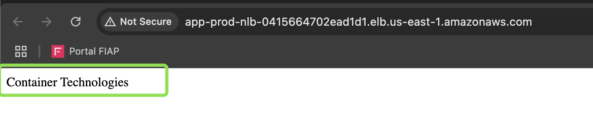

Como já foi provisionada a infraestrutura pra suportar a aplicação (Cluster ECS, NLB e SG), agora será necessário criar o workflow para realizar o deploy da aplicação de forma automatizada`Continuous Integration`, `Continuous Delivery` e `Continuous Deployment`


Sera utilizado os mesmos serviços do GitHub que utilizamos na pipeline de infra.

01. Na página inicial do GitHub (https://github.com/), no canto superior direito, clique em  [+], e em **New codespace**.


02. Preencha as informações, em **Repository** (selecione o repositório ), **Branch** (selecione a branch *main*), **Region** (selecione a região *US East*) e em **Machine type** (selecione *2-core*), por último clique em **Create codespace**


03. Após criado Codespaces, vá até o terminal para criar o arquivo `app.yml` para iniciar a criação do workflow do GitHub Actions de deploy da aplicação.

```shell
touch .github/workflows/app.yml
```


04. Clique no arquivo `app.yml` e cole o conteúdo abaixo (workflow) dentro do arquivo.

```yaml
name: 'Deploy App'

on:
  push:
    branches:
      - main

env:
  DESTROY: false
  TF_VERSION: 1.10.5
  IMAGE_NAME: ci-cd-app
  ECS_SERVICE: app-service
  ECS_CLUSTER: app-prod-cluster
  APP_VERSION: 1.0.0
  ENVIRONMENT: prod

jobs:
  Build:
    name: 'Building app'
    runs-on: ubuntu-latest
    outputs:
      image_tag: ${{ steps.set_tag.outputs.image_tag }}
    defaults:
      run:
        shell: bash
        working-directory: app

    steps:
      - name: Download do Repositório
        uses: actions/checkout@v4
        with:
          fetch-depth: 0

      - name: Set TAG_APP with SHA
        run: |
          echo "TAG_APP=v${{ env.APP_VERSION }}-$(echo $GITHUB_SHA | cut -c1-7)" >> "$GITHUB_ENV"

      - name: Set TAG_APP Output
        id: set_tag
        run: echo "image_tag=$TAG_APP" >> $GITHUB_OUTPUT

      - name: Show image TAG
        run: |
          echo "Image TAG" $TAG_APP
          echo "Image TAG" ${{ steps.set_tag.outputs.image_tag }}

      - name: Setup Python
        uses: actions/setup-python@v4
        with:
          python-version: '3.10'

      - name: Install Requirements
        run:  pip install flask

      - name: Unit Test
        run: python -m unittest -v test

      - name: Login to Docker Hub
        uses: docker/login-action@v3
        with:
          username: ${{ secrets.DOCKERHUB_USERNAME }}
          password: ${{ secrets.DOCKERHUB_TOKEN }}

      - name: Build an image from Dockerfile
        env:
          DOCKER_BUILDKIT: 1
        run: |
          docker build -t ${{ secrets.DOCKERHUB_USERNAME }}/${{ env.IMAGE_NAME }}:${{ env.TAG_APP }} .

      - name: Run Trivy vulnerability scanner
        uses: aquasecurity/trivy-action@master
        with:
          image-ref: '${{ secrets.DOCKERHUB_USERNAME }}/${{ env.IMAGE_NAME }}:${{ env.TAG_APP }}'
          format: 'table'
          exit-code: '1'
          ignore-unfixed: true
          vuln-type: 'os,library'
          severity: 'CRITICAL'

      - name: Push image
        run: |
          docker image push ${{ secrets.DOCKERHUB_USERNAME }}/${{ env.IMAGE_NAME }}:${{ env.TAG_APP }}

  Deploy:
    name: 'Deploy App'
    runs-on: ubuntu-latest
    needs: Build

    defaults:
      run:
        shell: bash
        working-directory: app

    steps:
      - name: Download do Repositório
        uses: actions/checkout@v4
        with:
          fetch-depth: 0

      - name: Configure AWS credentials
        uses: aws-actions/configure-aws-credentials@v4
        with:
          aws-access-key-id: ${{ secrets.AWS_ACCESS_KEY_ID }}
          aws-secret-access-key: ${{ secrets.AWS_SECRET_ACCESS_KEY }}
          aws-session-token: ${{ secrets.AWS_SESSION_TOKEN }}
          aws-region: ${{ vars.AWS_REGION }}

      - name: Fill in the new image ID in the Amazon ECS task definition
        id: task-def
        uses: aws-actions/amazon-ecs-render-task-definition@v1
        with:
          task-definition: ./app/deploy/ecs-task-definition.json
          container-name: ${{ env.IMAGE_NAME }}
          image: ${{ secrets.DOCKERHUB_USERNAME }}/${{ env.IMAGE_NAME }}:${{ needs.Build.outputs.image_tag }}
          taskRoleArn: arn:aws:iam::${{ secrets.AWS_ACCOUNT_ID }}:role/LabRole
          executionRoleArn: arn:aws:iam::${{ secrets.AWS_ACCOUNT_ID }}:role/LabRole

      - name: Register Task Definition
        id: task-definition
        uses: aws-actions/amazon-ecs-deploy-task-definition@v2
        with:
          task-definition: ${{ steps.task-def.outputs.task-definition }}

      - name: Terraform | Setup
        uses: hashicorp/setup-terraform@v3
        with:
          terraform_version: ${{ env.TF_VERSION }}

      - name: Terraform | Set up statefile S3 Bucket for Backend
        run: |
            echo "terraform {
              backend \"s3\" {
                bucket   = \"${{ secrets.AWS_ACCOUNT_ID }}-tfstate\"
                key      = \"app-${{ env.ENVIRONMENT }}.tfstate\"
                region   = \"${{ vars.AWS_REGION }}\"
              }
            }" >> provider.tf
            cat provider.tf
        working-directory: ./app/deploy

      - name: Terraform | Initialize backend
        run: terraform init
        working-directory: ./app/deploy

      - name: Terraform | Check Syntax IaC Code
        run: terraform validate
        working-directory: ./app/deploy

      - name: Terraform | Plan
        run: terraform plan -out tfplan.binary
        working-directory: ./app/deploy

      - name: Terraform Destroy
        if: env.DESTROY == 'true'
        run: terraform destroy -auto-approve -input=false
        working-directory: ./app/deploy

      - name: Terraform Creating and Update
        if: env.DESTROY != 'true'
        run: terraform apply -auto-approve -input=false
        working-directory: ./app/deploy

      - name: Deploy App in Amazon ECS
        uses: aws-actions/amazon-ecs-deploy-task-definition@v2
        with:
          task-definition: ${{ steps.task-def.outputs.task-definition }}
          service: ${{ env.ECS_SERVICE }}
          cluster: ${{ env.ECS_CLUSTER }}
          wait-for-service-stability: true
```


> Para mais informações sobre cada step do nosso workflow, [clique aqui!](./github-actions.md)

05. Crie os arquivos essenciais para o nosso projeto.

```shell
mkdir -p app && touch app/{.dockerignore,Dockerfile,app.py,test.py,requirements.txt,docker-compose.yml}
```


Proposito da criação de cada arquivo:

- `app.py` - Arquivo da aplicação
- `test.py` - Arquivo com o teste unitário
- `requirements.txt` - Arquivo para gerenciar dependências do Python, para mais informações [clique aqui!](https://docs.docker.com/build/concepts/context/#dockerignore-files)
- `.dockerignore` - Arquivo que define quais arquivos e diretórios devem ser ignorados durante o **build** da imagem Docker. Ele funciona de maneira semelhante ao `.gitignore`, impedindo que arquivos desnecessários (como logs, dependências locais, arquivos de configuração sensíveis e diretórios do Git) sejam copiados para a imagem final. Isso ajuda a reduzir o tamanho da imagem e a melhorar a segurança e a eficiência do build. [clique aqui!](https://docs.docker.com/build/concepts/context/#dockerignore-files)
- `Dockerfile` - Arquivo com as instruções para realizar o build da imagem da aplicação, para mais informações [clique aqui!](https://docs.docker.com/build/concepts/context/#dockerignore-files)
- deploy.tf - Arquivo que iremos utilizar para realizar o deploy da aplicação na `AWS` onde irá conter os nossos resources do terraform.
- `ecs-task-definition.json` - Definições de configurações para realizar o deploy da nossa aplicação dentro do cluster ECS.

#### Aplicação

A Aplicação é escrita em `python` e utiliza o **Flask** como servidor web.

06. No arquivo `app.py`, copie e cole o conteúdo abaixo:

```python
from flask import Flask

app = Flask(__name__)

@app.route("/")
def pagina_inicial():
    return "Container Technologies"
```


07. No arquivo `test.py` copie e cole o conteúdo abaixo.

```python
from app import app
import unittest

class Test(unittest.TestCase):
    def setUp(self):
        # cria uma instância do unittest, precisa do nome "setUp"
        self.app = app.test_client()

        # envia uma requisicao GET para a URL
        self.result = self.app.get('/')

    def test_requisicao(self):
        # compara o status da requisicao (precisa ser igual a 200)
        self.assertEqual(self.result.status_code, 200)

    def test_conteudo(self):
        # verifica o retorno do conteudo da pagina
        self.assertEqual(self.result.data.decode('utf-8'), "Container Technologies")
```


08. Para ter um controle melhor das versões de nossas dependências, iremos colar o conteúdo abaixo no arquivo `requirements.txt`.

```txt
flask == 3.1.0
gunicorn == 23.0.0
```


#### Build

Agora iremos utilizar o **Docker** para relizar a contrução da nossa imagem.

09. No arquivo `.dockerignore` , cope e cole o conteúdo abaixo:

```.dockerignore
Dockerfile
.git
.github
.gitignore
LICENSE
README.md
test.py
./deploy
```


10. No arquivo `Dockerfile`, copie e cole as informações abaixo.

```Dockerfile
FROM python:3.10-alpine3.21
LABEL MANTAINER="Seu Nome"

WORKDIR /app

COPY . /app

RUN apk add --no-cache curl \
    && pip install --trusted-host pypi.python.org -r requirements.txt

EXPOSE 8000

CMD ["gunicorn", "--bind", "0.0.0.0:8000", "app:app"]
```


11. No arquivo `docker-compose.yml` cole o conteúdo abaixo.

O `docker-compose.yml` é o arquivo onde passamos as instruções para realizar o build e testar a imagem localmente.

```docker-compose
version: "3.8"

services:
  app:
    build:
      context: .
      dockerfile: Dockerfile
    image: ci-cd-app:v1.0.0
    container_name: ci-cd-app
    restart: always
    ports:
      - "8000:8000"
    environment:
      - APP_ENV=production
```


#### Testando a aplicação localmente

Agora que incluiu todos os arquivos necessários e seus respectivos conteúdos, você irá testar a app localmente para verificar se está funcionando corretamente. Afinal precisa funcionar localmente (Elimina aquele problema de que só funciona na minha máquina rs).

12. O arquivo `docker-compose.yml`, contém as informações necessárias para subirmos o nosso ambiente localmente.

13. Utilize o comando `docker-compose` para subir a sua aplicação localmente.

```bash
cd app/ && docker compose up
```

Ao digitar o comando, a sua aplicação irá realizar o build da imagem e subir localmente.
Repare que no canto inferior direito, abre sobe uma mensagem `Your application running on port 8000 is available. See all forwarded ports`, clique no botão **Open in Browser**.


14. Ao clicar no botão, você será redirecionado para uma url que seu aplicativo que está sendo executado local sera exposto.


Pronto, tudo certo! Seu app está funcionando corretamente localmente! :)

15. Pra parar a execução localmente, pressione `CTRL + C`.


Agora que testou novamente,  iremos avançar para a configuração do próximo arquivo, mas antes execute o comando para voltar para o diretório `app`.

```shell
cd ..
```

#### Deployment

Agora você chegou na fase de adicionar os arquivos do deploy da aplicação.

16. 005. Crie os arquivos essenciais para o deploy da aplicação.

```shell
mkdir -p app/deploy && touch app/deploy/{ecs-task-definition.json,deploy.tf,outputs.tf,terraform.tfvars,variables.tf,versions.tf}
```


17. No arquivo `ecs-task-definition.json` copie e cole o conteúdo abaixo:

> Altere o ARN com o ID da sua conta, para funcionar o deploy!

    "taskRoleArn": "arn:aws:iam::**893298020274**:role/LabRole"
    "executionRoleArn": "arn:aws:iam::**893298020274**:role/LabRole"

```JSON
{
    "containerDefinitions": [
        {
            "name": "ci-cd-app",
            "image": "gersontpc/ci-cd-app:v1.0.0",
            "cpu": 0,
            "portMappings": [
                {
                    "name": "port-access-8080",
                    "containerPort": 8000,
                    "hostPort": 8000,
                    "protocol": "tcp",
                    "appProtocol": "http"
                }
            ],
            "essential": true,
            "environment": [],
            "environmentFiles": [],
            "mountPoints": [],
            "volumesFrom": [],
            "ulimits": [],
            "logConfiguration": {
                "logDriver": "awslogs",
                "options": {
                    "awslogs-group": "/ecs/ci-cd-app",
                    "mode": "non-blocking",
                    "awslogs-create-group": "true",
                    "max-buffer-size": "25m",
                    "awslogs-region": "us-east-1",
                    "awslogs-stream-prefix": "ecs"
                },
                "secretOptions": []
            },
            "systemControls": [],
            "healthCheck": {
                "command": ["CMD-SHELL", "curl -f http://0.0.0.0:8000 || exit 1"],
                "interval": 15,
                "timeout": 5,
                "retries": 3,
                "startPeriod": 20
            }
        }
    ],
    "family": "ci-cd-app",
    "taskRoleArn": "arn:aws:iam::893298020274:role/LabRole",
    "executionRoleArn": "arn:aws:iam::893298020274:role/LabRole",
    "networkMode": "awsvpc",
    "volumes": [],
    "placementConstraints": [],
    "requiresCompatibilities": [
        "FARGATE"
    ],
    "cpu": "512",
    "memory": "1024",
    "runtimePlatform": {
        "cpuArchitecture": "X86_64",
        "operatingSystemFamily": "LINUX"
    },
    "tags": [
        {
            "key": "Name",
            "value": "ci-cd-app"
        }
    ]
}
```


18. No arquivo do Terraform `deploy.tf` copie e cole o conteúdo abaixo:

```hcl
data "aws_lb_target_group" "this" {
  name = "app-prod-tg"
}

data "aws_security_groups" "this" {
  filter {
    name   = "tag:Name"
    values = ["app-prod-sg"]
  }
}

data "aws_lb" "this" {
  name = var.lb_name
}

resource "aws_ecs_service" "this" {
  name                          = "app-service"
  task_definition               = "ci-cd-app"
  cluster                       = var.cluster_name
  desired_count                 = var.desired_count
  launch_type                   = "FARGATE"
  availability_zone_rebalancing = "ENABLED"
  network_configuration {
    subnets          = var.subnets_id
    security_groups  = data.aws_security_groups.this.ids
    assign_public_ip = true
  }

  load_balancer {
    target_group_arn = data.aws_lb_target_group.this.arn
    container_name   = "ci-cd-app"
    container_port   = 8000
  }

}

resource "aws_cloudwatch_log_group" "this" {
  name              = "/ecs/ci-cd-app"
  retention_in_days = 7
}
```


19. No arquivo `variables.tf` copie e cole o conteúdo abaixo:

```hcl
variable "cluster_name" {
  description = "Nome do cluster ECS"
  type        = string
  default     = "app-prod-cluster"
}

variable "desired_count" {
  description = "desired tasks"
  type        = number
  default     = 3
}

variable "subnets_id" {
  description = "Subnets IDs"
  type        = list(string)
}

variable "lb_name" {
  description = "Load Balancer Name"
  type        = string
  default     = "app-prod-nlb"
}
```


20. No arquivo `versions.tf`, cope e cole o contaúdo abaixo:

```hcl
terraform {
  required_version = "1.10.5"
  required_providers {
    aws = {
      source  = "hashicorp/aws"
      version = "~> 5.86.0"
    }
  }
}
```


21. No arquivo `outputs.tf`, copie e cole o conteúdo abaixo:

```hcl
output "nlb_dns_name" {
  value = format("http://%s", data.aws_lb.this.dns_name)
}
```


22. No arquivo `terraform.tfvars`, copie e cole o conteúdo abaixo:

```
subnets_id = [
  "sua-subnet-a",
  "sua-subnet-b",
  "sua-subnet-c"
]
```


Agora que você já criou todos os arquivos necessários, iremos seguir para a criação da conta no `dockerhub`, para realizar o push da imagem do Docker da aplicação.

#### Criação de conta no Dockerhub

Docker Hub é um repositório online de imagens Docker, onde os desenvolvedores podem armazenar, compartilhar e distribuir contêineres. Ele serve como um registro público e privado para armazenar imagens de aplicativos, facilitando a automação do deploy e a colaboração entre equipes.

23. Para criar a conta, acesse https://hub.docker.com/, caso já tenha conta pule para a sessão [Secrets DockerHub](#secrets-dockerhub).

24. No canto superior esquerdo clique em **Sign up**.


24. Na página de criação de conta, clique na aba **Personal** (Uso pessoal), em **E-mail** (Insira o seu e-mail), **Username** (Insira seu nome de usuário), **Password** (Insira uma senha) e por último clique em **Sign up**, para criar a sua conta.


25. Após a criação da conta, será necessário acessar o seu e-mail para verificar a conta do DockerHub, clique em **Verify Email Addres**.


26. Após clicar em **Verify Email Addres**, será direcionado para a tela informando que seu e-mail foi verificado com sucesso, clique em **Sign In** para realizar o login.


27. Você será redirecionado para a tela de login, em **Username or email address**, insira o seu nome de usuário ou e-mail, em seguida clique em **Continue**.


28. Insira a sua senha e clique novamente em **Continue**.


Ao clicar em **Sign up** você será redirecionado o para o site do Docker, conta criada com sucesso!


Agora que você já possui a conta, iremos configurar duas secrets no GitHub, no seu projeto.

#### Secrets DockerHub

29. Em seu repositório vá até **Settings** -> **Secrets and variables** -> **Actions** -> **New repository secret**.


30.  Em **New secret**, crie a secret `DOCKERHUB_USERNAME` e coloque o username do seu dockerhub.


31. Repita o processo e crie a secret `DOCKERHUB_TOKEN`, e coloque a sua senha no valor da **Secret**

Logo abaixo, a imagem com as duas secrets criadas.


Agora volte para o codespaces, para commitar os arquivos que foram criados.

32. Commite os arquivos executando o comando abaixo:

```shell
git add -A
git commit -m "feat: Deploy application"
```


33. Realize o push das alterações.

```shell
git push
```


34. Assim que realizar o push, volte para o repositório e clique na aba `Actions`, logo em seguida clique na action **feat: Deploy application** para acompanhar o deploy.


35. Repare que haverá dois workflows, o **Building app** (realiza o build da imagem) e **Deploy App** (Realiza o deploy da aplicação).


36. No workflow **Deploy App**, vá até o step **Deploy App in Amazon ECS** para acompanhar o deploy.


37. Volte no console da AWS no Serviço **Amazon Elastic Container Service - ECS** > **Clusters** > Cluster: **app-prod-cluster** > **Services** clique no serviço **app-service**, vá até a aba **Deployments**, e repare que em **Deployment status** há um deploy em andamento **In Progress**.


Aguarde até que o deploy seja concluído.

38. Volte na action de Deploy e repare que o deploy foi concluído.


39. Volte no console da AWS no Serviço **Amazon Elastic Container Service - ECS** > **Clusters** > Cluster: **app-prod-cluster** > **Services** clique no serviço **app-service**, vá até a aba **Tasks**, há 3 tasks (containers) em execução, na aba das tasks em **Health status** o status deve ser **Healthy**.


40. Para validar a aplicação volte no Workflow **Deploy Infra** e vá até o step **Terraform Creating and Update**, clique no DNS do loadbalancer para acessar a aplicação.


41. Pronto! Foi realizado o deploy da aplicação com sucesso!



Neste laboratório foi realizado o build do artefato da aplicação e em seguida o deploy da service no cluster ECS que foi provisionado no laboratório de infra.

Ao acessar o dns do NLB ele irá direcionar a requisição para o listener `:80`, que será redirecionado para o target group na porta `8000` do container que é uma (task) configurada na service do ECS.

Diagrama abaixo da arquitetura:


### Conclusão do Laboratório
Parabéns! 🎉 Você acaba de concluir o laboratório de provisionamento de infraestrutura e deploy automatizado de uma aplicação no Amazon ECS.

Neste laboratório, você aprendeu a:  
✅ Provisionar a infraestrutura necessária utilizando Terraform.  
✅ Configurar workflows no GitHub Actions para automação de CI/CD.  
✅ Realizar o build, teste e publicação de imagens Docker no Docker Hub.  
✅ Automatizar o deploy de uma aplicação no Amazon ECS com alta disponibilidade.

Agora você compreende como é possível automatizar todo o ciclo de vida de uma aplicação, desde a infraestrutura até o deploy, utilizando ferramentas modernas de DevOps. 🚀
