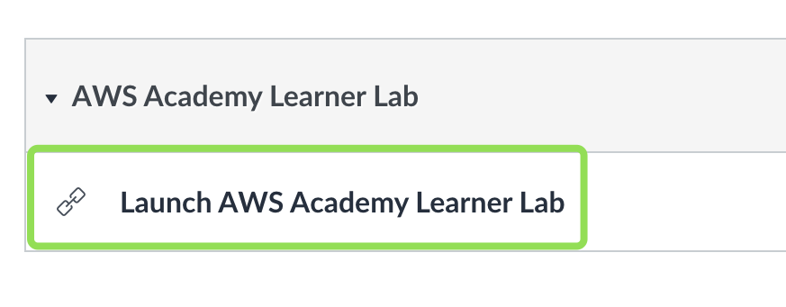
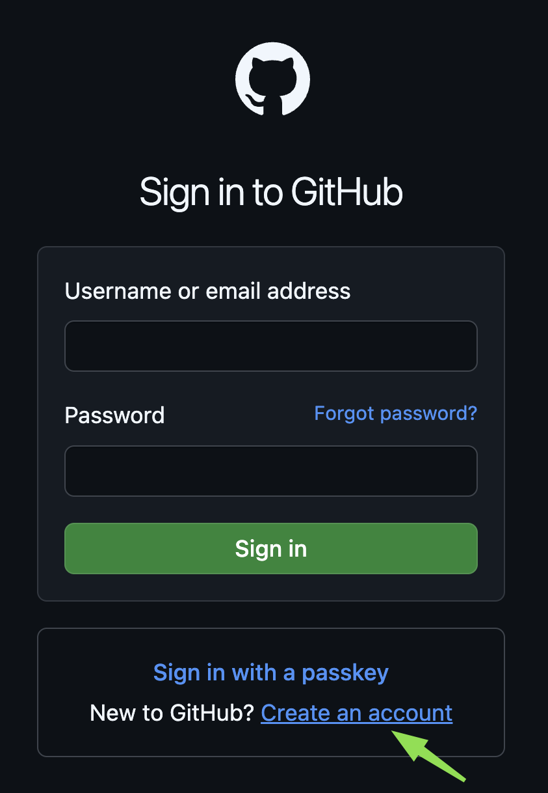
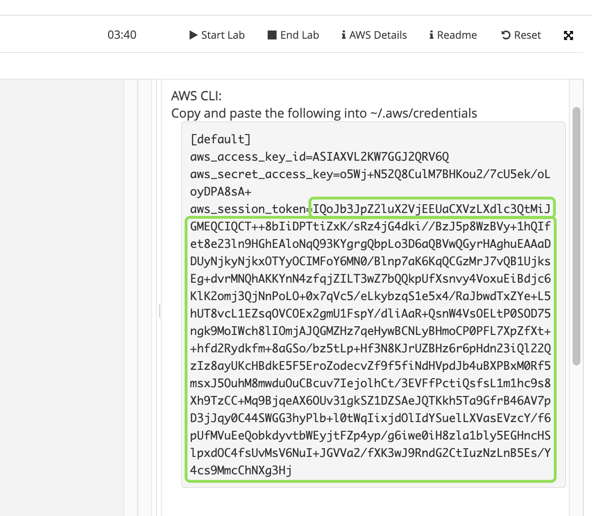
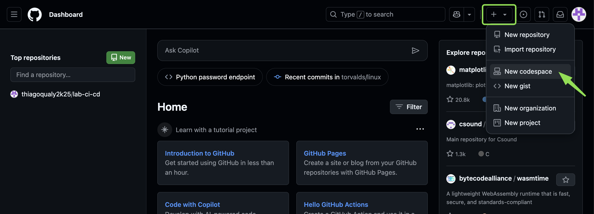

### Acessando o AWS Academy

001. Para iniciar o nosso lab, será necessário logar no **AWS Academy**, clicando no link: [clique aqui!](https://www.awsacademy.com/vforcesite/LMS_Login), logo após clique em **Student Login**!


002. Realize o login na sua conta academica, em **Username**, insira o e-mail da sua conta (A conta que você se cadastrou no AWS Academy), e em **Password**, insira a senha que você cadstrou e por último, clique em **Log In** para acessar a conta.


003. Após realizar o acesso, no lado esquerdo clique em **Courses**, e em seguida em **All Courses**.


004. Em **All Courses**, clique no curso liberado pelo professor, **AWS Academy Learner Lab [pegar o ID do curso com o professor]**.


005. Clique em **Modules**.


006. Desça até **AWS Academy Learner Lab**, e clique em  **Launch AWS Academy Learner Lab**.



007. Clique em **Startup Lab**, para iniciar o laboratório, (AWS 🔴)


008. Aguarde alguns minutos até que a aba AWS fique verde, (AWS 🟢).

### Acessando o console da AWS

Após ficar verde, clique em cima!


009. Ao clicar, será redirecionado para o **Console da AWS**.


010. Pesquise pelo serviço S3 e clique no serviço S3 - *Simple Storage Service*.


011. Clique em **Create bucket**.


012. Antes de criarmos o Bucket, precisaremos do ID da conta da AWS do nosso laboratório!

Vá até o topo do console da AWS e clique na sua conta **voclabs/user2575295=gerson.carneiro...**, em **Account ID** copie o ID da sua conta. 


013. No serviço **Bucket name**, coloque conforme abaixo (substitua pelo ID da sua conta), ficando da seguinte forma: *526926919628*-tfstate.

Aqui estamos criando o bucket para armazenar o statefile da nossa infraestrutura que será provisionada.


014. Desça a página e clique em **Create bucket**.


015. Pronto, bucket criado!


Agora que o **Bucket** foi criado, crie uma conta no github pois iremos utilizar alguns dos serviços do github neste laboratório, os principais serviços que utilizaremos são: repositório, github actions, codespaces e vscode web.

### Criando a conta no github

016. Acesse o site do github [https://github.com/](https://github.com/), e clique em **Sign in**.


017. Se já tiver conta no github, insira o **Username or email address** (e-mail) e **Password** (Senha), depois clique em **Sign in**, caso não tenha conta, vá até **New to GitHub?**, clique em **Create an account** (Criar uma conta).



018. Em **Sign up to GitHub**, insira o **Email** (E-mail), **Password** (Senha) e **Username** (Nome do usuário), por último clique em **Continue**, para concluir a criação da conta.


019. Após clicar em continuar, será enviado um código para o e-mail cadastrado para concluir com a criação da conta.


020. Após inserir o código, você será redirecionado para a página de login.

Repare na mensagem confirmando a criação da sua conta: **Your account was created successfully. Please sign in to continue**

Insira o **e-mail** e **senha** e clique em **Sign in**, para fazer o login!


021. Pronto conta criada com sucesso!


Alguns links recomendados para iniciar a jornada no GitHub.
- [GitHub Skills](https://skills.github.com/)
- [Introduction to GitHub](https://github.com/skills/introduction-to-github)
- [Review pull requests](https://github.com/skills/review-pull-requests)
- [Code with Codespaces](https://github.com/skills/code-with-codespaces)
- [Code with Copilot](https://github.com/skills/copilot-codespaces-vscode)
- [Automate workflows with GitHub Actions](https://skills.github.com/#automate-workflows-with-github-actions)

### Importando repositório da aula

022. Agora que você já tem a conta no github, após efetuar o login, vá até o canto superior direito, clique em [+], em seguida clique em **Import repository**.

> **Import vs fork** 
> 
> - **Import:** A importação geralmente se refere a trazer código de um repositório externo para um repositório existente ou para um novo repositório. Cria uma cópia completa e independente do repositório original em sua própria conta.
> 
> - **Fork:** Um fork cria uma cópia completa e independente do repositório original em sua própria conta. Essa cópia é um repositório separado, com seu próprio histórico de commits e branches. O fork é frequentemente usado para contribuir com projetos de código aberto. Você pode fazer alterações no seu fork e, em seguida, enviar um "pull request" para o repositório original, solicitando que suas alterações sejam incorporadas. O fork oferece isolamento, permitindo que você experimente e faça alterações sem afetar o repositório original.


023. Em **Import your project to GitHub**, em **The URL for your source repository**, cole o repositório que utilizaremos de template: https://github.com/gersontpc/template-ci-cd, desça até **Your new repository details** em **Repository name**, coloque o nome `lab-ci-cd` (repare que este nome de repositório em minha conta encontra-se disponível), por último clique em **Begin import**, para importar o repositório.


Aguarde alguns minutos até concluir a importação.


023. Após a concluir a importação do repositório, clique no repositório importado.


024. Repositório importado.


### Pipeline de infra


Neste primeiro workflow, iremos provisionar a da arquitetura apresentada em aula  na AWS utilizando Terraform, para automatizar este processo, iremos utilizar o GitHub Actions, neste workflow iremos utilizar o TFlint, TFsec, Terraform Docs.

- [GitHub Actions](https://docs.github.com/pt/actions/writing-workflows/quickstart)
- [TFLint](https://github.com/terraform-linters/tflint)
- [Terraform Docs](https://terraform-docs.io/)
- [ECS - Elastic Container Service](https://docs.aws.amazon.com/pt_br/AmazonECS/latest/developerguide/Welcome.html)

### GitHub Workflow

Antes de abordarmos sobre a estratégia de Branch, nós iremos utilizar um mono-repo para contruir uma pipeline para provisionar a infraestrutura, realizar os build/testes de nossa aplicação e por último o deploy. 

Iremos utilizar 2 Branchs principais, uma branch de `infra` que ao realizar o merge nela, irá acionar o workflow (pipeline) de infra, e a branch `main` que será utilizada para realizar o ci/cd de nossa aplicação.


Os engenheiros irão utilizar `feature` branchs a partir da branch que será utilizada, seja de infra ou aplicação.

### Criando as secrets necessárias

Antes de criarmos a nossa pipeline é necessário criarmos algumas secrets para que nosso workflow faça a criação do cluster ECS na AWS.

Iremos criar as seguintes variáveis: 

```shell
AWS_ACCESS_KEY_ID
AWS_SECRET_ACCESS_KEY
AWS_SESSION_TOKEN
AWS_REGION
AWS_ACCOUNT_ID
```

Para criar as variáveis no github, vá até o seu repositório importado [lab-ci-cd](lab-ci-cd), clique na aba **Settings**, no menu esquerdo, vá até **Secrets and variables**, **Actions** e clique em **New repository secret**.


025. Mas antes de criar a secret, vá para o console do AWS Academy, clique em **AWS Details**,  em **AWS CLI**, clique no botão **Show**.


Copie o valor `aws_access_key_id` .


Volte para o github onde parou anteriormente e crie a AWS_ACCESS_KEY_ID, e cole o valor que copiou anterior copiado do console AWS Academy, por fim, clique em **Add secret**.


Pronto, secret criada!


Agora iremos repetir o mesmo processo para o restante das secrets!

026. Crie a secret AWS_SECRET_ACCESS_KEY, clique no botão **New repository secret**


Volte no console AWS academy e copie o valor aws_secret_access_key.


E cole no valor da Secret, e clique em **Add Secret**.


027. Crie a secret AWS_SESSION_TOKEN, clique no botão **New repository secret**


Volte no console AWS academy e copie o valor aws_session_token.



Cole no valor na Secret, e clique em **Add Secret**.


028. Crie a secret AWS_REGION, clique no botão **New repository secret**


Volte no console AWS academy desça a página e copie o valor de **Region**.


Cole o valor da **Region** na Secret, e clique em **Add Secret**.


030. Finalmente adicione última secret rs, agora adicione AWS_ACCOUNT_ID.


Volte no console AWS academy desça a página e copie o valor de **AWSAccountId**.


Cole o valor da **AWSAccountId** na Secret, e clique em **Add Secret**.


Pronto! todas as secrets necessárias foram criadas!

> Toda vez que o laboratório for desligado, será necessário reimportar os valores das secrets `AWS_ACCESS_KEY_ID`, `AWS_SECRET_ACCESS_KEY` e `AWS_SESSION_TOKEN`.


031. Ainda nas configurações do repositório (**Settings**), no menu esquerdo, clique em **Actions** em seguida **General**.


032. Desça a página até **Workflow permissions** e altere a permissão para **Read and write permissions** e por último clique em **Save**.

> Essa permissão permite que os workflows tenham permissão de leitura e escrita no repositório, permitindo realizar commits se necessário no repositório.


### Pipeline Infraestrutura

Agora iremos utilizar o GitHub CodeSpaces para começar a construir o nosso workflow de infra.

033. Na página inicial do GitHub (https://github.com/), no canto superior direito, clique em  [+], e em **New codespace**.



034. Preencha as informações, em **Repository** (selecione o repositório recém importado), **Branch** (selecione a branch *infra*), **Region** (selecione a região *US East*) e em **Machine type** (selecione *2-core*), por último clique em **Create codespace**


035. Após criar o codespace, seremos redirecionados para uma [IDE](https://github.com/features/codespaces).


036. Ao decorrer do nosso laboratório, iremos utilizar o terminal para digitar os comandos necessários para criarmos o nosso workflow.


037. Seguindo a nossa estratégia de branchs (GitHub Workflow), execute o comando do git para fazer o checkout na branch de infra.

```shell
git checkout infra
```


038. Execute o comando abaixo para criar os diretórios  `.github/workflows`  e arquivo `infra.yml`  para inserir o código do nosso workflow.

```shell
mkdir -pv .github/workflows
touch .github/workflows/infra.yml
```


039. Abra o arquivo `infra.yml` e cole o conteúdo abaixo para a criação do nosso workflow.

Para mais informações sobre cada step do Github Actions: [Clique aqui!](./github-actions.md)

```yaml
name: 'Terraform Infra'

on:
  push:
    branches:
      - infra
env:
  TF_VERSION: 1.10.5
  TF_LINT_VERSION: v0.52.0
  DESTROY: false
  ENVIRONMENT: prod

jobs:
  terraform:
    name: 'Deploy Infra'
    runs-on: ubuntu-latest

    defaults:
      run:
        shell: bash
        working-directory: infra

    steps:
    - name: Checkout
      uses: actions/checkout@v4

    - name: AWS | Configure credentials
      uses: aws-actions/configure-aws-credentials@v4
      with:
        aws-access-key-id: ${{ secrets.AWS_ACCESS_KEY_ID }}
        aws-secret-access-key: ${{ secrets.AWS_SECRET_ACCESS_KEY }}
        aws-session-token: ${{ secrets.AWS_SESSION_TOKEN }}
        aws-region: ${{ secrets.AWS_REGION }}

    - name: Terraform-docs | Generate documentation
      uses: terraform-docs/gh-actions@v1.3.0
      with:
        working-dir: ./infra
        output-file: README.md
        output-method: inject
        git-push: "true"

    - name: Terraform | Check required version
      run: |
        if [ -f versions.tf ];
          then
            echo "TF_VERSION=$(grep required_version versions.tf | sed 's/"//g' | awk '{ print $3 }')" >> $GITHUB_ENV
          else
            echo "Not set required_version in versions.tf, using default version in variable TF_VERSION in file .github/workflows/infra.yml"
            echo "TF_VERSION="${{ env.TF_VERSION }}"" >> $GITHUB_ENV
        fi

    - name: Terraform | Setup
      uses: hashicorp/setup-terraform@v3
      with:
        terraform_version: ${{ env.TF_VERSION }}

    - name: Terraform | Show version
      run: terraform --version

    - name: Terraform | Set up statefile S3 Bucket for Backend
      run: |
          echo "terraform {
            backend \"s3\" {
              bucket   = \"${{ secrets.AWS_ACCOUNT_ID }}-tfstate\"
              key      = \"${{ secrets.AWS_ACCOUNT_ID }}/"${{ env.ENVIRONMENT }}.tfvars"\"
              region   = \"${{ secrets.AWS_REGION }}\"
            }
          }" >> provider.tf
          cat provider.tf

    - name: Terraform | Initialize backend
      run: terraform init

    - name: Terraform | Format code
      run: terraform fmt

    - name: Terraform | Check Syntax IaC Code
      run: terraform validate

    - name: TFlint | Cache plugin directory
      uses: actions/cache@v4
      with:
        path: ~/.tflint.d/plugins
        key: ${{ matrix.os }}-tflint-${{ hashFiles('.tflint.hcl') }}

    - name: TFlint | Setup TFLint
      uses: terraform-linters/setup-tflint@v4
      with:
        tflint_version: ${{ env.TF_LINT_VERSION }}

    - name: TFlint | Show version
      run: tflint --version

    - name: TFlint | Init TFLint
      run: tflint --init
      env:
        GITHUB_TOKEN: ${{ github.token }}

    - name: TFlint | Run TFLint
      run: tflint -f compact

    - name: TFSec | Security Checks
      uses: aquasecurity/tfsec-action@v1.0.0
      with:
        soft_fail: true

    - name: Terraform | Plan
      run: terraform plan -out tfplan.binary

    - name: Terraform | Show to json file
      run: terraform show -json tfplan.binary > plan.json

    - name: Terraform Destroy
      if: env.DESTROY == 'true'
      run: terraform destroy -auto-approve -input=false

    - name: Terraform Creating and Update
      if: env.DESTROY != 'true'
      run: terraform apply -auto-approve -input=false
```

Ficando da seguinte forma:


040. Agora iremos executar o comando para criar o nosso diretório de infra e os arquivos necessários para o terraform.

```shell
mkdir -p infra && touch infra/{main.tf,nlb.tf,outputs.tf,sg.tf,variables.tf,versions.tf,terraform.tfvars}
```

Arquivos criados conforme o comando executado!


041. Agora iremos colocar os nossos "bloquinhos" do terraform de acordo com os arquivos criados.

042. Copie e cole o conteúdo abaixo no arquivo `main.tf`

```terraform
resource "aws_ecs_cluster" "this" {
  name = format("%s-cluster", var.cluster_name)

  setting {
    name  = "containerInsights"
    value = "enabled"
  }
}
```

043. Copie o conteúdo abaixo e cole no arquivo `nlb.tf`.

```terraform
# Crie um Network Load Balancer
resource "aws_lb" "this" {
  name = format("%s-nlb", var.cluster_name)

  subnets            = var.subnets_id
  security_groups    = [aws_security_group.allow_inbound.id]
  load_balancer_type = "network"

  tags = {
    Name = format("%s-nlb", var.cluster_name)
  }
}

# Crie um listener para o NLB
resource "aws_lb_listener" "this" {
  load_balancer_arn = aws_lb.this.arn
  port              = 80
  protocol          = "TCP"

  default_action {
    type             = "forward"
    target_group_arn = aws_lb_target_group.this.arn
  }
}

# Crie um target group
resource "aws_lb_target_group" "this" {
  name        = format("%s-tg", var.cluster_name)
  port        = 80
  protocol    = "TCP"
  vpc_id      = var.vpc_id
  target_type = "ip"

  tags = {
    Name = format("%s-tg", var.cluster_name)
  }
}
```

044. Copie e cole o conteúdo abaixo no arquivo `sg.tf`.

```terraform
# Crie um grupo de segurança
resource "aws_security_group" "allow_inbound" {
  name        = format("%s-sg", var.cluster_name)
  vpc_id      = var.vpc_id
  description = "Allow inbound traffic"

  ingress {
    from_port   = 8000
    to_port     = 8000
    protocol    = "TCP"
    cidr_blocks = ["0.0.0.0/0"]
  }

  egress {
    from_port   = 0
    to_port     = 0
    protocol    = "-1"
    cidr_blocks = ["0.0.0.0/0"]
  }

  tags = {
    Name = format("%s-sg", var.cluster_name)
  }
}
```

045. Copie e cole o conteúdo abaixo no arquivo `variables.tf`.

```terraform
variable "cluster_name" {
  description = "Nome do cluster ECS"
  type        = string
}

variable "subnets_id" {
  description = "Subnets IDs"
  type        = list(string)
}

variable "vpc_id" {
  description = "VPC ID"
  type        = string
}
```


046. Copie e cole o conteúdo abaixo no arquivo `outputs.tf`.

```terraform
output "load_balancer_arn" {
  value = aws_lb_target_group.this.arn
}

output "nlb_dns_name" {
  value = format("http://%s", aws_lb.this.dns_name)
}
```

047. Copie e cole o conteúdo abaixo no arquivo `versions.tf`.

```terraform
xterraform {
  required_version = "1.10.5"
  required_providers {
    aws = {
      source  = "hashicorp/aws"
      version = "~> 5.86.0"
    }
  }
}
```

048. Copie e cole o conteúdo abaixo no arquivo `terraform.tfvars`.

```terraform
cluster_name = "app-prod"

vpc_id = ""

subnets_id = [
  "",
  "",
  ""
]
```

Após colar o conteúdo do arquivo `terraform.tfvars` precisamos preencher as variáveis `vpc_id` e `subnets_id`.

Será necessário acessar o console da AWS para pegar os IDs das Subnets e VPC.

049. No console da AWS, pesquise por VPC e clique em **VPC** (*Isolated Cloud Resources*).


050. Em vpc, no menu esquerdo, clique em **Your VPCs** e na coluna **VPC ID** copie o id do VPC e cole na variável `vpc_id` do arquivo terraform.tfvars.


```terraform
cluster_name = "app-prod"

vpc_id = "vpc-0adcac6bf7f8c2e7f"

subnets_id = [
  "",
  "",
  ""
]
```

051. Ainda em VPC no menu esquerdo, clique em **Subnets** ordene as subnets por **Availability Zone** e copie as subnets `us-east-1a`, `us-east-1b` e `us-east-1c`. 


```terraform
cluster_name = "app-prod"

vpc_id = "vpc-0adcac6bf7f8c2e7f"

subnets_id = [
  "subnet-0fbf2767834e01e3c",
  "subnet-0803c20d0114bae14",
  "subnet-06bf008b57618c9c8"
]
```

Para mais informações sobre cada resource do Terraform, [Clique aqui!](./terraform.md)

052. Como já preenchemos todos os nossos arquivos do terraform e suas variáveis, iremos criar o último arquivo, o `.gitignore`

Execute o comando abaixo no terminal.

```shell
touch .gitignore
```

053. Copie o conteúdo abaixo e cole no arquivo `.gitignore` .

```gitignore
### Git ###
# Created by git for backups. To disable backups in Git:
# $ git config --global mergetool.keepBackup false
*.orig

# Created by git when using merge tools for conflicts
*.BACKUP.*
*.BASE.*
*.LOCAL.*
*.REMOTE.*
*_BACKUP_*.txt
*_BASE_*.txt
*_LOCAL_*.txt
*_REMOTE_*.txt

### Terraform ###
# Local .terraform directories
**/.terraform/*
.terraform.lock.hcl
# .tfstate files
*.tfstate
*.tfstate.*

# Crash log files
crash.log
crash.*.log

# Exclude all .tfvars files, which are likely to contain sensitive data, such as
# password, private keys, and other secrets. These should not be part of version
# control as they are data points which are potentially sensitive and subject
# to change depending on the environment.
# *.tfvars
*.tfvars.json

# Ignore override files as they are usually used to override resources locally and so
# are not checked in
override.tf
override.tf.json
*_override.tf
*_override.tf.json

# Include override files you do wish to add to version control using negated pattern
# !example_override.tf

# Include tfplan files to ignore the plan output of command: terraform plan -out=tfplan
# example: *tfplan*

# Ignore CLI configuration files
.terraformrc
terraform.rc
```


054. Para executarmos o nosso workflow, precisamos criar a branch infra `feature/init-infra`.


```bash
git checkout -b feature/init-infra

```

055. Agora iremos commitar as nossas alterações.

```bash
git add -A
git commit -m "chore: create ci/cd infra"
```


056. Realize o push das alterações.

```bash
git push --set-upstream origin feature/init-infra
```


057. Volte para o repositório do github, clique na aba **Pull requests**, e repare que terá um novo pull request: **feature/init-infra had recent pushes 2 minutes ago**, clique no botão **Compare & pull request**.


058. Abra o pull request da branch **feature/init-infra** para branch **infra**.


059. Faça o merge clicando no botão **Merge pull request**, para mesclar a **feature/init-infra** para branch **infra**.


060. Após realizar o merge a *Action* será acionada, clique na aba **Actions**, de clique no workflow **Deploy Infra**, para acompanhar o provisionamento da infra.


061. Ao clicar em **Deploy infra**, terá a visualização do workflow com o deploy da infra (Cada um dos steps será explicados um a um em sala de aula!), agora clique no step **Terraform Creating and Update**, para visualizar a criação da infra.


061. Repare que foram criados 5 recursos conforme o output do `terraform apply`.


062. Agora volte no [console](https://us-east-1.console.aws.amazon.com/console/home?region=us-east-1) da AWS para checar se o Cluster ECS, Security Group e NLB foram provisionados conforme esperado.

Abaixo o print com os recursos criados!

ECS > Cluster ECS:


EC2 >  Network & Security > Cluster ECS:


EC2 > Load Balancing > Load Balancers


Show! agora que temos a nossa infraestrutura necessária provisionada iremos seguir para o workflow da nossa app!
